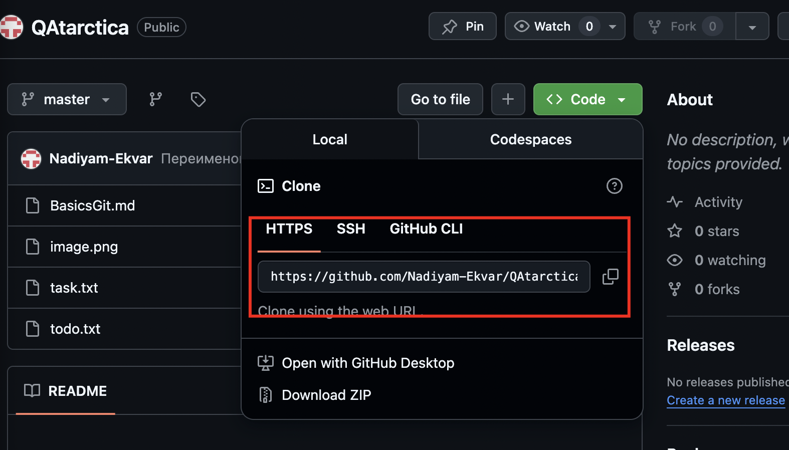
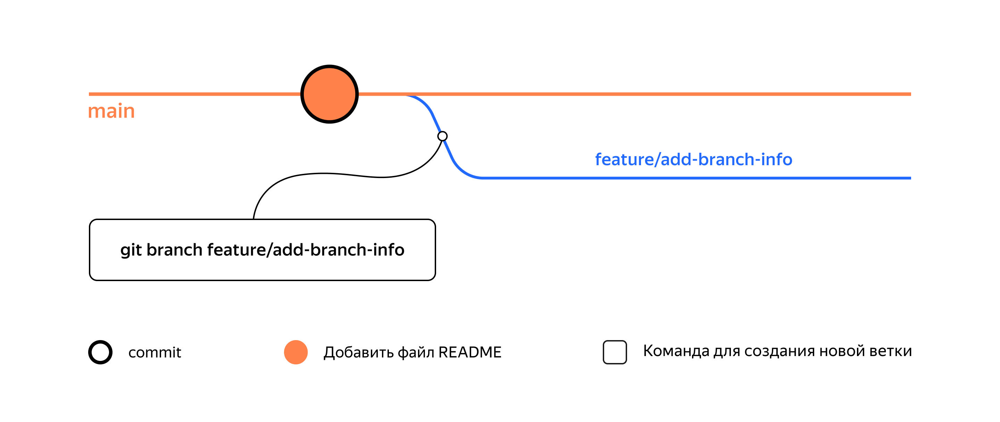

# Основы работы с ветками Git

## 1. Клонируем репозиторий

Сначало необходимо скопировать ссылку для клонирования с git

Далее, через консоль переходим в папку в которую хотим сохранить.
После набираем команду:

    git clone {Скопированная ссылка папки}

Команда git clone автоматически связывает локальный и удалённый репозиторий. То есть если в GitHub-репозитории что-то поменяется (например, добавятся коммиты), вам не нужно будет заново клонировать его. Достаточно будет выполнить команду, которая обновит вашу копию.

## 2. Выполняем Fork

Fork (англ. «развилка», «ответвление»), или «форк», — это GitHub-операция; напрямую с Git она не связана. «Форк» создаёт копию репозитория в аккаунте GitHub. Такая копия будет полностью независима. Изменения, которые вы внесёте, не будут синхронизированы с исходным репозиторием.

## 3. Что такое ветка 

Ветка (англ. branch) — это изолированный поток разработки проекта. В таком потоке можно проверять разные идеи, тестировать новую функциональность и так далее.

Команда для просмотра веток 

    Git branch

пример: 

    git branch 
    * main # мы в основной ветке

    # чтобы выйти из просмотра веток, может понадобиться Q!

Если в параметр  передать название можно создать новую ветку:

    git branch feature/add-branch-info

Название ветки в Git может состоять из букв, цифр, а также включать любой из четырёх символов: ., -, _, /. Эти символы не несут особого смысла. Например, ветка feature/add-branch-info могла бы называться feature_add-branch-info или feature-add-branch. Обратите внимание, что ветки не образуют иерархии, как директории, разделённые символом /.

Переключится на другую ветку можно с помощью команды:

    git checkout <Название ветки>

Пример:

    $ git checkout feature/add-branch-info # перешли в новую ветку
    Switched to branch 'feature/add-branch-info'

    $ git branch # проверили

    * feature/add-branch-info # теперь находимся тут
    main

Можно создать ветку и сразу начать в ней работать. За это отвечает команда git checkout с флагом -b (от англ. branch) и названием ветки. 

    $ git checkout main
    $ git checkout -b bugfix/fix-branch # создали ветку и сразу на неё переключились
    Switched to a new branch 'bugfix/fix-branch'

    $ git branch
    * bugfix/fix-branch # сразу в нужной ветке
    feature/add-branch-info
    main

Команда git branch показывает только локальные ветки – те, которые существуют на вашем локальном компьютере.

## 4. Прасматриваем все ветки

Когда вы работаете с несколькими ветками в проекте, полезно уметь просматривать все доступные ветки – хранящиеся как на вашем компьютере, так и на сервере GitHub. 
Для этого используется команда git branch -a. Флаг -a в команде git branch -a означает “all” (англ. «все»). Использование этого флага позволяет команде отображать все ветки в репозитории:

Локальные ветки будут указываться как обычно при вызове git branch, например, feature/add-branch-info.

Удалённые – с префиксом remotes/origin: remotes/origin/feature/add-branch-info.

Отдельно будет указана основная ветка: строка с ней будет выглядеть как remotes/origin/HEAD -> origin/main. 
Прочитать эту строку можно как «Главной веткой является main».

## 5. Сравниваем ветки

в Git есть суффикс навигации ~N, где N — это число. Он отсчитывает от заданного коммита N коммитов назад во времени. Нумерация начинается с нуля: commit~0 — это сам коммит, commit~1 — предыдущий, commit~2 — предшествующий предыдущему и так далее.

Пример:

    $ git diff feature/diff~1 feature/diff

## 6. Объяденияем и удаляем ветки

Для слияния веток необходимо перейти в ветку куда должны добавить измененияю
Далее прописываем команду git merge и указываем ветку, которую необходимо объяденить.

пример

    $ git checkout main # переключились на главную ветку

    $ git merge feature/diff # объединили ветки
    Updating 079cfbf..f30d441
    Fast-forward
    README.md | 2 ++
    1 file changed, 2 insertions(+)

После того как произошло слияние, ветку-донора можно удалить. Для этого в основной ветке введите команду git branch с флагом -D (от англ. delete — «удалить») и названием ветки.

пример

    $ git branch # проверяем местоположение
    bugfix/fix-branch
    feature/add-branch-info
    feature/diff
    * main

    $ git checkout main # если не в основной, переходим в неё

    $ git branch -D feature/diff # удаляем поглощаемую ветку
    Deleted branch feature/diff (was f30d441).

У команды git branch -D есть более безопасный вариант с флагом -d. Он удалит ветку только если она была полностью объединена с другой — то есть если две ветки стали (или изначально были) частью одной истории. Например, если вы нечаянно создали ветку с неправильным названием, её можно удалить через git branch -d %имя_ветки%. 

⚠️ Удаление локальной ветки через Git не удаляет ветку на GitHub!

## 7. Что такое конфликт

Конфликт — это ситуация, в которой один или несколько человек модифицировали один и тот же файл. При этом результаты таких модификаций оказались несовместимы и разобраться в том, какой из вариантов правильный, может только человек.

Конфликты необходимо проанализировать и исправить вручную.

## 8. Отправить локальную ветку в удаленный репозиторий

В Github создаем репозиторий как обычно. После привязываем его к локальному:

    git remote add origin git@github.com:%ИМЯ_АККАУНТА%/git-branches.git

Убедитесь, что находитесь в основной ветке, и выполните команду git push с флагом -u, который свяжет локальную ветку с удалённой. Также команде нужно передать параметры origin и имя текущей ветки.

    $ git push -u origin main

Для публикации новой ветки

    $ git push -u origin feature/merge-request

## 9. Создаём pull request

У каждого пул-реквеста есть:
- Название — краткое описание предлагаемых изменений. Например: Адаптивный заголовок сайта, Замена альбома на галерею и так далее.

- Описание — развёрнутое описание изменений. Это поле заполнять необязательно, но желательно.

- Исходная ветка — та, в которой вы работали. Например, feature/merge-request.

- Целевая ветка — основная ветка проекта, в которую вы хотите внести изменения.

Также у каждого пул-реквеста может быть два исхода:
- merge (англ. «соединить») — предлагаемые изменения приняты; код вливается в целевую ветку; пул-реквест закрывается.

- close (англ. «закрыть») — пул-реквест закрывается без слияния изменений.

## 10. Забираем изменения из удаленного репозитория

Чтобы скачать изменения из удалённого репозитория, следует выполнить команду git pull (от англ. pull — «вытянуть») — стянуть, или «запулить» изменения.

    $ git checkout main # перешли в main
    $ git pull # подтянули новые изменения в main
    $ git checkout my-branch # вернулись в рабочую ветку my-branch
    $ git merge main # влили main в новую ветку my-branch
    $ git push -u origin my-branch # отправили ветку my-branch в удалённый репозиторий

